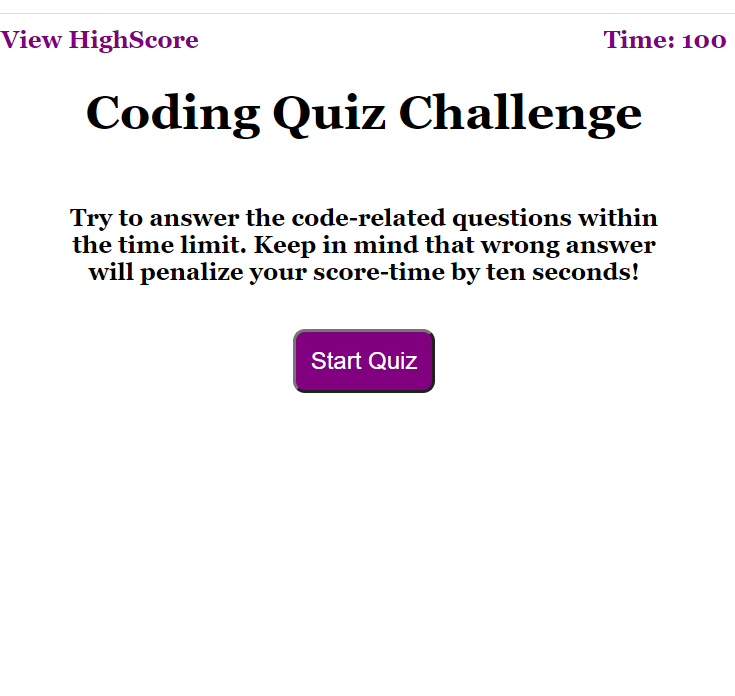
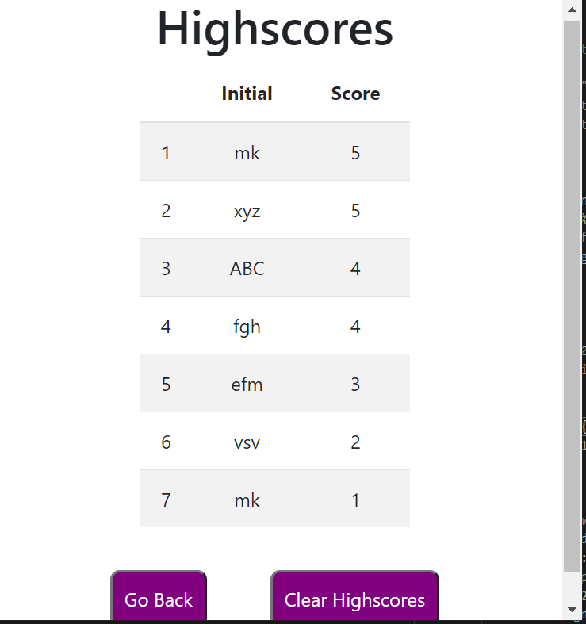

# 04-homework
Code Quiz 04-Homework

This is a timed Quiz on HTML and Javascript fundamentals that any student can take 
and store the high scores to check the progress and comapre with peers

When user is ready to take the Quiz, they can start by clicking the 
strat button.

____________
When the start button is clicked, a question appears on the screen
with 4 different answers and the timer starts (currently it is set for 100 secs)

Each question has a time out of 10 seconds.
  - If the user Answers the questions correctly, he.she
get 1 point and the next question
  - If user answers wrongly, 2 seconds will be taken off of 
the Quiz time
  - If user can't answer the question for 10 seconds, then
the question will be chnaged.

The above steps continue till the timer reaches 0 
or the questions are over (to keep it simple)

At the end of the Quiz, user can provide the initial(only
lower and upper case letters are accpets upto 5 characters)
and save the highscore.
When the user clicks the submit button with initials, 
user is directed to a new page which shows the high scores

Highscores are in order of high to low score.
This page provides the user to either clear all scores 
or go back to Quiz again.

